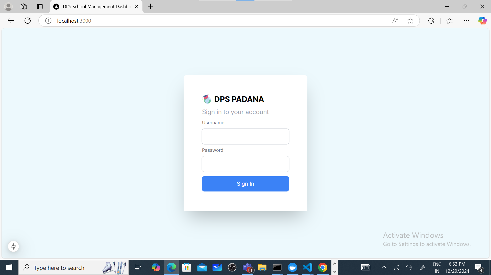

# School Management Application

A feature-rich, full-stack application designed to streamline school operations. This platform efficiently manages teachers, students, parents, classes, events, announcements, and more.

## Features

- **User Management**: Separate interfaces for teachers, students, and parents.
- **Event Management**: Organize and announce events with ease.
- **Class Management**: Assign and manage classes seamlessly.
- **Secure Authentication**: Implemented using Clerk for robust authentication and authorization.
- **Responsive Design**: Built with Next.js and Tailwind CSS for a modern, mobile-friendly UI.
- **Consistent Environments**: Deployed with Docker for reliable production setups.

## Technologies Used

### Frontend:
- **Next.js**: For server-side rendering and dynamic web pages.
- **Tailwind CSS**: For responsive and sleek UI design.
- **TypeScript**: Ensuring type safety and scalable code.

### Backend:
- **PostgreSQL**: For a reliable and efficient relational database.
- **Clerk**: For secure authentication and user management.

### Deployment:
- **Docker**: For containerized deployment ensuring consistency across environments.

## Screenshots

Here are some screenshots of the application:





## YouTube Demo

Check out the live demo of the application on YouTube:
[School Management Application Demo](https://www.youtube.com)

## Installation

1. **Clone the repository:**
   ```bash
   git clone https://github.com/developer-shahrukh/school-full-stack.git
   ```

2. **Navigate to the project directory:**
   ```bash
   cd school-full-stack
   ```

3. **Install dependencies:**
   ```bash
   npm install
   ```

4. **Set up environment variables:**
   - Create a `.env` file in the root directory.
   - Add the necessary configuration (e.g., database connection, Clerk API keys).

5. **Run the development server:**
   ```bash
   npm run dev
   ```
   Access the application at `http://localhost:3000`.

6. **Build and run with Docker:**
   ```bash
   docker build -t school-app .
   docker run -p 3000:3000 school-app
   ```

## Contact

For questions or feedback, feel free to reach out:
- **Email**: shahrukhm412@gmail.com
- **GitHub**: [developer-shahrukh](https://github.com/developer-shahrukh)
